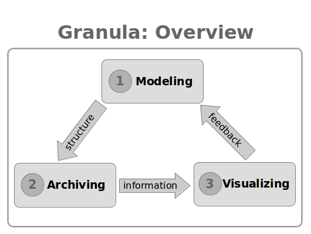

# Granula
Granula is a fine-grained performance evaluation framework for Big Data Processing (BDP) systems, consisting of three main modules: the modeler, the archiver and the visualizer, which map respectively to the process of performance modeling, performance archiving and performance visualizing.

* Performance Modeling: Performance evaluation on BDP systems is a time-consuming process: the performance analysts need to study both the high-level design and the low-level implementation of a BDP system, run jobs on the BDP system to extract performance information, analyze the gathered performance information, derive new insights from the performance results and finally elaborate the conclusion by means of text and diagrams. The knowledge on how to conduct performance evaluation requires much domain-specific expertise, which is worth preserving. However, the evaluation process, or better to say, the evaluation method, is usually described in only a few paragraphs, in an academic publication, or less formally, in a web page or a blog post. Such description leaves out lots of details which makes the evaluation process difficult to reproduce. The Granula modeler allows performance analysts to define their evaluation method for a BDP system explicitly, such that other performance analysts can follow each step in the evaluation process and examine the validity of the performance model.

* Performance Archiving: To take a step further, the performance model created by the Granula modeler is for the evaluation of each BDP job, a performance archive can be built programmatically with the Granula archiver, which serves as a snapshot of a BDP job that encapsulates the complete set of performance information in a structural way. The performance archive is self-contained (that is, without asking where the results can be found), self-explanatory (that is, without asking what the results stand for) and self-proving (i.e., without asking how the results are derived).

* Performance Visualizing: while a performance archive is sufficiently informative, it is not the most natural way of browsing through the performance results. The Granula visualizer presents the performance archive in a human-readable manner, allows efficient navigation of performance results, such that those results can be easily communicated among performance analysts.

In each iteration of the performance evaluation, performance analysts first study the BDP system and update the performance model with the newly discovered insights. Then they proceed by running jobs on the BDP system and creating performance archives for those BDP jobs. By reviewing the performance results via the Granula visualizer, they gain new insights of the system which can be used to refine the per formance model. After iterations, knowledge on the BDP system performance is built up in an incremental manner.

** The Granula project is in the pre-alpha stage, which is still subjected to major revisions in the coming months. **
